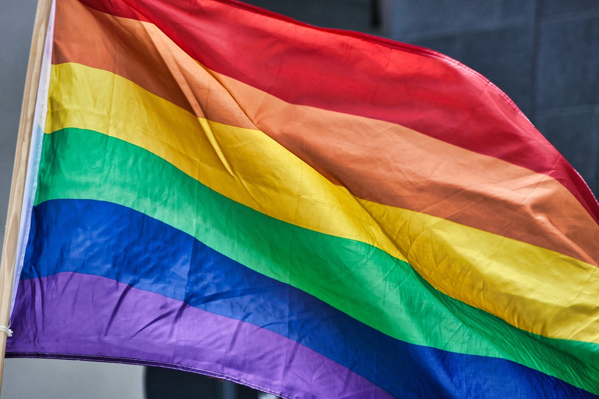

    <h1>Welcome to the Minnesota LGBT Transplant Resource Hub</h1>
    

# Minnesota LGBT Transplant Resource Hub

Explore resources to help you settle into Minnesota’s LGBT-friendly community!

- [Why Minnesota](why.md)
- [Resources](resources.md)
- [Testimonials](testimonials.md)
- [Volunteer](volunteer.md)

